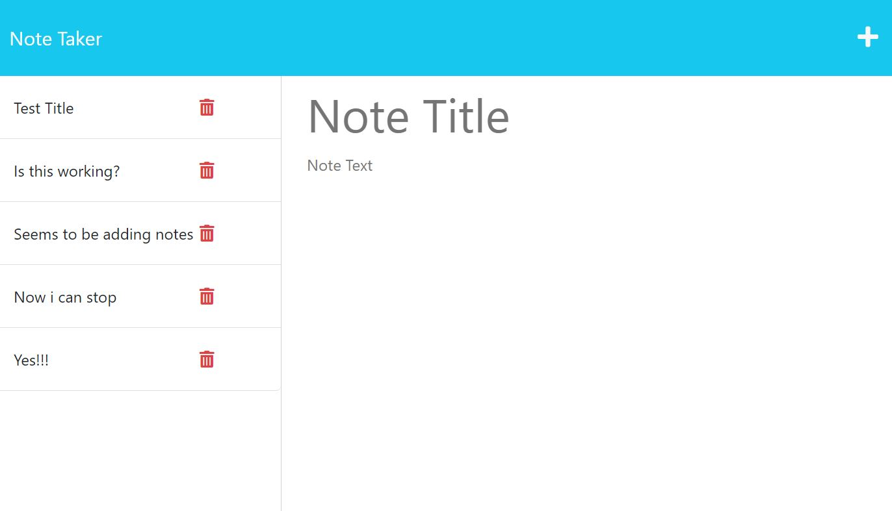

# Note-Taker-Challenge-11

## My Task

My task was to take the starter code that was provided in challege folder 02 in Module 11 and finish the code for a basic note taking app where a user can add a note and view past notes. a bonus would be to figure out how to delete notes. then after finsihing the code, deploy it with heroku.


## User Story

```
AS A small business owner
I WANT to be able to write and save notes
SO THAT I can organize my thoughts and keep track of tasks I need to complete
```


## Acceptance Criteria

```
GIVEN a note-taking application
WHEN I open the Note Taker
THEN I am presented with a landing page with a link to a notes page
WHEN I click on the link to the notes page
THEN I am presented with a page with existing notes listed in the left-hand column, plus empty fields to enter a new note title and the note’s text in the right-hand column
WHEN I enter a new note title and the note’s text
THEN a Save icon appears in the navigation at the top of the page
WHEN I click on the Save icon
THEN the new note I have entered is saved and appears in the left-hand column with the other existing notes
WHEN I click on an existing note in the list in the left-hand column
THEN that note appears in the right-hand column
WHEN I click on the Write icon in the navigation at the top of the page
THEN I am presented with empty fields to enter a new note title and the note’s text in the right-hand column
```


## Screenshot and Websites

The following images show the web application's appearance and functionality:




## Bonus

With the help of ChatGPT and Google i was able to figure out how to delelte a note. a common error i would get would be (TypeError: noteArray.splice is not a function), and after some research, figured out it was a issue with my deleteNote fucntion when im calling it in my notes routes.


### Technical Acceptance Criteria: 40%

* Satisfies all of the preceding acceptance criteria plus the following:

  * Application front end must connect to an Express.js back end.

  * Application back end must store notes that have a unique id in a JSON file.

  * Application must be deployed to Heroku.


### Deployment: 36%

* Application deployed at live URL.

* Application loads with no errors.

* Application GitHub URL submitted.

* GitHub repository contains application code.


### Application Quality: 11%

* Application console is free of errors.


### Repository Quality: 13%

* Repository has a unique name.

* Repository follows best practices for file structure and naming conventions.

* Repository follows best practices for class/id naming conventions, indentation, quality comments, etc.

* Repository contains multiple descriptive commit messages.

* Repository contains quality README file with description, screenshot, and link to deployed application.


### Bonus: +10 Points

* Application allows users to delete notes.


## Review

You are required to submit BOTH of the following for review:

* The URL of the functional, deployed application.

* The URL of the GitHub repository, with a unique name and a README describing the project.

- - -
© 2023 edX Boot Camps LLC. Confidential and Proprietary. All Rights Reserved.
